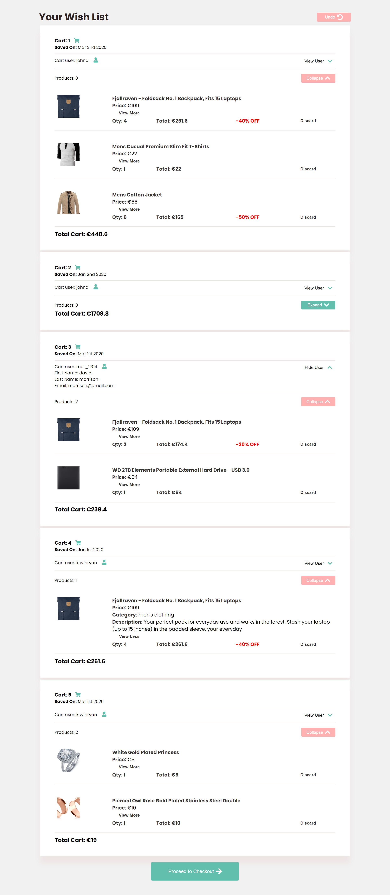

# Droppe XMAS

## Table of contents

- [General Info](#General-Info)
- [Tech Stack](#tech-stack)
- [Home](#home)
- [Wishlist](#wishlist)
- [Checkout](#checkout)

## General Info

Droppe X-mast is a fully functional shopping cart where users can view, approve or delete certain items from their product, and have an overview on discounts, total expenditure on carts, approved carts and deleted products and carts. App is deployed on Netlify at 

## Tech Stack

- TypeScript
- React.js
- Redux
- Redux-Saga
- Sass
- Local Storage

## Home

User starts from the home page and can be redirected to the wishlist page.

## Wishlist

In the wishlist page, users can view all the 5 carts fetched to the shopping API. Each cart displays the current user, which can be show or hidden, and the products in the cart. The cart view can be expanded or collapsed. Some of the products, depending on the quantity, are on discount. The user can remove single items from each cart, and the cart total price will be recalculated. If the user clicks the "Undo" button, the cart data will be refreshed. If the user removes all products from the cart, the cart will be automatically removed from the wishlist.

## Checkout

In the checkout page the user will be able to see all the approved carts and the total expense per cart, and the carts with products that were not approved.

